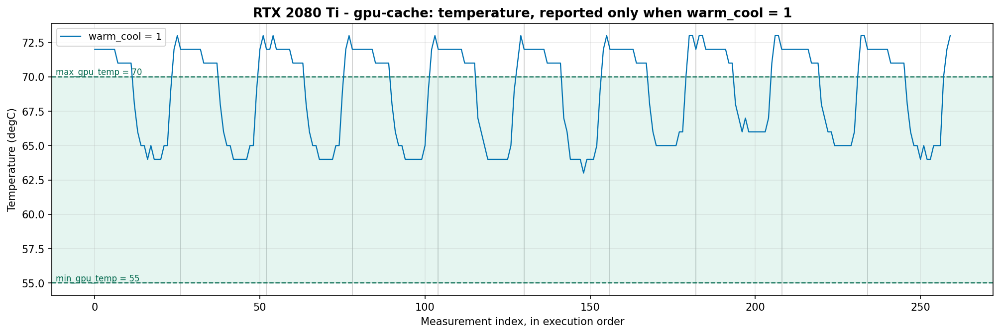
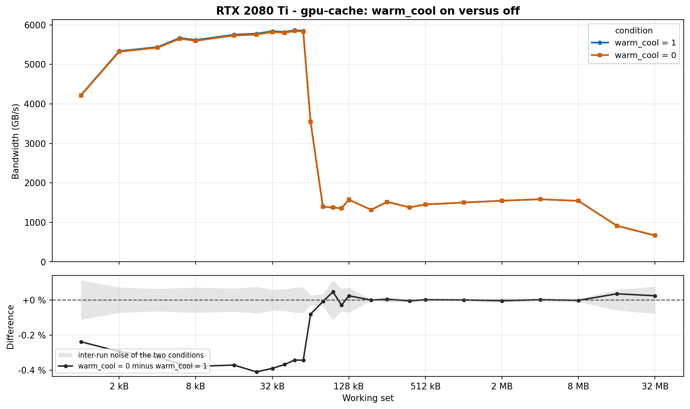

# Results

Measurements collected with this repository, kept on the `helio_log` branch alongside the raw
runs that produced them. Two things are shown here:

1. **What each benchmark knob actually changes** — measured, not assumed.
2. **How the same benchmark behaves across architectures** — native CUDA, hipified HIP on the
   same NVIDIA card, and HIP on a real AMD card.

The methodology of each benchmark lives in its own `gpu-benches/<name>/GPU-<name>.md`. This
document only reports what was observed.

```
RESULTS.md          this file
logs/               raw campaign output, one directory per campaign
figures/            the plots referenced below, as PNG
```

---

# Part 1 — Impact of the benchmark parameters

Every plot in this part compares the **same workload on the same GPU**, changing exactly one
option. The point is to justify the defaults, and to make visible what silently breaks a
measurement when a knob is wrong.

## The measurement loop

All of these options belong to the `Benchmark` section of the protocol. This is the loop they
act on, transcribed from `baseliner/core/Benchmark.hpp`:

```
setup_host                                          → HostSetupTime
setup_device                                        → DeviceSetupTime
warmup                one untimed run               → WarmupTime
repeat until the stopping criterion is satisfied:   ← one iteration = one batch
   ├─ warm_cool       bring the GPU inside the temperature window, then stop checking
   ├─ block           freeze the stream so the whole batch is queued before it runs
   ├─ init_batch
   ├─ for each of batch_size runs:
   │     ├─ unblock       every block_queue_size runs
   │     ├─ reset_device
   │     ├─ flush         empty L2 — before every run, not once per batch
   │     └─ timed run     → ExecutionTime
   └─ dynamic_batch   resize batch_size from the duration of the batch that just ran
fetch_results                                       → FetchResultsTime
validate_workload
```

Two things this ordering settles, both of which matter for reading the sections below:

- **`flush` runs inside the batch**, before each timed run, so it is paid `batch_size` times
  per iteration.
- **`warm_cool` runs outside it**, once per batch. Its loop exits as soon as the temperature is
  inside the window; nothing re-reads the sensor while the batch executes.

## The options, and what the campaigns actually used

Defaults are those declared in `Benchmark.hpp`; the last column is the value the campaigns in
`logs/` ran with. The gap between the two columns is not an error — the protocols override the
defaults deliberately.

| Option | Default | Effect | Used in `logs/` |
|---|---|---|---|
| `flush` | `1` | Empties L2 before every timed run | `1` |
| `warm_cool` | `0` | Holds the GPU in a temperature window before each batch | `1` |
| `min_gpu_temp` | `45.0` | Below it, a warming kernel runs | `55.0` |
| `max_gpu_temp` | `60.0` | Above it, the GPU is actively cooled | `70.0` |
| `warm_cool_timeout` | `3` | Seconds before the window is given up on, and the run throws | `60` |
| `warmup` | `1` | One untimed run before the loop | `1` |
| `batch_size` | `25` | Timed runs per iteration | `10` |
| `block` | `1` | Blocking kernel: the batch is queued before any of it executes | `1` |
| `block_duration` | `1000.0` | How long (ms) the blocking kernel holds the stream | `1000.0` |
| `block_queue_size` | `64` | Runs between two releases of the blocking kernel | `64` |
| `dynamic_batch` | `0` | Doubles or halves `batch_size` to reach `minimal_batch_duration` | `0` |
| `minimal_batch_duration` | `10.0` | Target batch duration (ms) when `dynamic_batch` is on | `10.0` |
| `validate_workload` | `0` | Checks the workload output after the loop | `0` |
| `max_nb_repetition` | `100` | Iterations of the loop (`StoppingCriterion` section) | `100` |

**One documentation bug, worth a one-line fix.** In `Benchmark.hpp`, `max_gpu_temp` is described
as *"the minimum accepted temperature before cooling down the GPU"*. It is the **maximum**; the
string was copied from `min_gpu_temp`.

---

## 1.1 `flush` — L2 flush before every timed run

**Default** `1`. Calls `L2Flusher::flush()` between `reset_device` and the timed run, inside the
batch loop.

**Why it matters** Without it, data left in L2 by the previous run is still resident when the
next one starts. The kernel then reads from cache what it was supposed to read from memory, and
the reported bandwidth is not the bandwidth of the level being probed.

**Expected** No effect once the working set is far larger than L2 — the data could not have
stayed resident anyway. An effect in the L1/L2 region.

**Experiment** `gpu-cache`, full `working_set_elements` sweep, 10 runs per condition,
`flush` ∈ {0, 1} with everything else fixed.

**Observed** *Nothing yet: the data of this experiment was lost.* The campaign of
2026-08-31 ran both experiments, but the two wrote their results under the same file names
(`avec-runNN.json`, `sans-runNN.json`); `warm_cool` ran second and overwrote `flush`. The
`manifest.csv` describes 40 runs where 20 files remain. Which set survived is not a guess: the
manifest gives 722 s, constant across the ten runs of `warmcool/sans`, against 738–771 s for
`flush/sans`, and the files on disk have a standard deviation of 0.1 s.

**Verdict** To re-run, prefixing the outputs by experiment (`flush-avec-runNN.json`) so the two
cannot collide.

---

## 1.2 `warm_cool` — hold the GPU inside a temperature window

**Default** `0`, window `45–60 °C`, `warm_cool_timeout` `3 s`. Before each batch, a warming
kernel runs until the GPU reaches `min_gpu_temp`, or the GPU is cooled until it drops below
`max_gpu_temp`. If the window is not reached within the timeout, the run throws.

**Why it matters** A campaign is long. Its first benchmarks run on a cold GPU and its last ones
on a hot, possibly throttled one. That drift is indistinguishable from a real difference between
the benchmarks unless the temperature is held.

**Experiment** `gpu-cache` on the RTX 2080 Ti, backend `cuda`, campaign
`results_flush_warmcool_20260831_163028`: 26 working-set sizes × 10 runs per condition,
`warm_cool` ∈ {0, 1}, window `55–70 °C`, timeout 60 s, everything else identical.

**Observed**

*The regulation works, but only between batches.* With `warm_cool = 1` the temperature draws a
sawtooth: the card is brought back down to 63–65 °C before each batch, then climbs freely to
73 °C while the batch runs. Only **46 % of the points sit inside the requested 55–70 °C
window**, and the excursions above `max_gpu_temp` are not a malfunction — the loop in
`Benchmark.hpp` breaks as soon as the window is reached and never reads the sensor again until
the next batch.

*The effect on the measurement is real but very small.* Across the 26 sizes the median
difference is **−0.02 %**. It is not uniform, though: below ~64 kB, where the working set is
cache-resident, `warm_cool = 0` reads **0.2 to 0.4 % lower**, and on **12 of the 26 sizes** that
gap is larger than the combined inter-run spread of the two conditions. Past that point, once
the working set spills to DRAM, the difference falls back into the noise. The direction is
consistent with the mechanism: a hotter card clocks slightly lower, and the cache-resident
region is where the measurement depends most on the core clock rather than on memory.

*Reproducibility improves marginally.* Median inter-run CoV is **0.038 %** with the option on
against **0.048 %** with it off — both far below the level at which any conclusion in this
document would change.

**Verdict** On this workload and this card, `warm_cool` changes the measured bandwidth by less
than half a percent, in the cache-resident region only. That is small enough not to threaten the
cross-architecture comparisons in Parts 2 to 4, and large enough to be worth keeping enabled
when two configurations are compared at a fraction of a percent. Its cost is real: the campaign
takes longer, since each batch waits for the window.

**One limitation of this experiment.** `warm_cool = 0` reports **no temperature at all**. The
sensor is registered only when the option is on — `setup_metrics()` guards
`register_stat<DeviceTemperature>()` behind `get_warm_cool()`. So the thermal drift of a
`warm_cool = 0` campaign cannot be observed directly, only inferred from its effect on the
metric. Reading the sensor independently of `warm_cool` would close that gap, and is the single
change that would make this section conclusive rather than indicative.





---

# Part 2 — Native CUDA on the RTX 2080 Ti

Three configurations, the same source workloads:

| Label | Build | Hardware | What it isolates |
|---|---|---|---|
| `cuda` | `release-cuda` | RTX 2080 Ti | Reference |
| `hipifiable@nvidia` | `release-hip-nvidia` | RTX 2080 Ti | Cost of the hipify translation, same hardware |
| `hipifiable@amd` | `release-hip-only` | MI210 | Behaviour on the target architecture |

The first two run on the **same card**, so any gap between them comes from the translation and
from nvcc compiling HIP, never from a hardware difference. The third changes the hardware, so
it is read against AMD's published figures rather than against the first two.

Each configuration gets its own part: **Part 2** below is the CUDA reference, **Part 3** puts
the two backends side by side on the same card, and **Part 4** is the MI210. Every figure comes
from a campaign of **10 runs**; `logs/` holds the raw output of all three.

Three benchmarks are shown as a dedicated layout rather than a curve, following what the
upstream repository publishes for them: an ILP x TLP table for `gpu-incore`, a 16-column
stride table for `gpu-strides`, and the `T = a + V/b` fit for `gpu-small-kernels`.

---

## 2.1 gpu-cache

_(to fill: bandwidth per memory level, three curves; L1/L2 thresholds vs specs)_


## 2.2 gpu-incore

_(to fill: rcp_throughput vs theoretical 32/N; FP32/FP64 ratio)_


## 2.3 gpu-l2-stream


## 2.4 gpu-latency


## 2.5 gpu-memcpy


## 2.6 gpu-roofline


## 2.7 gpu-small-kernels


## 2.8 gpu-strides


## 2.9 gpu-umstream


---

# Part 3 — CUDA versus HIP on the same NVIDIA card

Both campaigns ran on an RTX 2080 Ti of the same node, over **identical sweep points**, so the
comparison is point by point and the only variable is the backend.

Each figure carries the **mean of the 10 runs** of each backend, the shaded band being their
min–max spread, and a lower panel giving the HIP/CUDA ratio. That lower panel is where the
gap is actually readable: on most benchmarks the two means sit on top of each other.

**Read the envelopes before the gap.** Where the two min–max bands overlap, the difference
between the means is inside the run-to-run noise and means nothing.

**One caveat on the hardware.** The two campaigns used different PCI slots of the same node
(`3B:00.0` for CUDA, `5E:00.0` for HIP), recorded in each `metadata.json`. Same GPU model,
same node, but not guaranteed to be the same physical die.

---

## 3.1 gpu-cache


## 3.2 gpu-incore


## 3.3 gpu-l2-stream


## 3.4 gpu-latency


## 3.5 gpu-memcpy


## 3.6 gpu-roofline


## 3.7 gpu-small-kernels


## 3.8 gpu-strides


## 3.9 gpu-umstream


---

# Part 4 — HIP on the AMD MI210

The target architecture, 10 runs, backend `hip`.

**This part is read on its own.** Three benchmarks sweep a different range here than on the
2080 Ti — `gpu-cache` covers 40 points against 26, `gpu-memcpy` 24 against 21, `gpu-umstream`
26 against 19 — and the hardware differs anyway. The curves of Parts 2 and 3 do not
superimpose on these.

The power policy also differs, which matters when reading anything clock-related: the MI210
ran under a **230 W cap with free clocks** (`amd-smi`), while both 2080 Ti campaigns had their
**clocks pinned to TDP** (`nvidia-smi`) and no power cap.

---

## 4.1 gpu-cache


## 4.2 gpu-incore


## 4.3 gpu-l2-stream


## 4.4 gpu-latency


## 4.5 gpu-memcpy


## 4.6 gpu-roofline


## 4.7 gpu-small-kernels


## 4.8 gpu-strides


## 4.9 gpu-umstream


---

# Part 5 — Reproducing this

Every figure in this document comes from one of three campaigns, each kept whole under `logs/`:

| Campaign | Backend | Hardware | Used by |
|---|---|---|---|
| `Log_Test_RTX2080ti_cuda` | `cuda` | RTX 2080 Ti | Parts 2 and 3 |
| `Log_Test_RTX2080ti_hip` | `hip` | RTX 2080 Ti | Part 3 |
| `Log_Test_MI210` | `hip` | AMD Instinct MI210 | Part 4 |

Each directory holds 191 files:

```
logs/Log_Test_<target>/
├── metadata.json                the conditions of the campaign
├── <benchmark>.proto.json       the protocol actually used          (9)
├── <benchmark>.run<NN>.json     one file per repetition, NN = 01..10 (90)
├── <benchmark>.run<NN>.json.log the workload's own output           (90)
└── run.log                      the orchestrator log
```

Run numbers are **zero-padded** so alphabetical order matches numerical order.

`metadata.json` records the machine, the GPU and its PCI address, the backend, the build preset,
the baseliner version, the throttling policy and the number of runs. Two limits are worth
stating plainly rather than discovering later:

- **The commit is not recorded.** `git_version` is `not-provided` in all three campaigns: the
  build did not populate it. The binary that produced these numbers cannot be identified from
  the results alone.
- **Driver and toolkit versions are not recorded either.** Neither the campaign files nor the
  result JSON carry them.

The throttling policy is not the same on both cards, and it is a field to read before comparing
anything clock-related: the MI210 ran under a **230 W cap with free clocks** (`amd-smi`), while
both 2080 Ti campaigns had their **clocks pinned to TDP** with no power cap (`nvidia-smi`).

One more thing the result files do not carry: the options of the `Benchmark` section. A report
holds only `id`, `results` and `hardware`, so the value of `flush` or `warm_cool` for a given
run exists **only** in that campaign's `.proto.json` and `metadata.json`. Anything varied there
has to be either promoted to a sweep axis, where it lands in each result's `sweep_point`, or
recorded by hand in the metadata.

The figures under `figures/` are produced from these campaigns by a notebook that is **not yet
in this repository**, so they cannot currently be regenerated from a clone alone.

Build and run instructions are in the [README](README.md). The quickest check that a build is
sane at all:

```bash
./build/release-cuda/gpu-benches_exec run --tiny --output-file tiny.json
```
