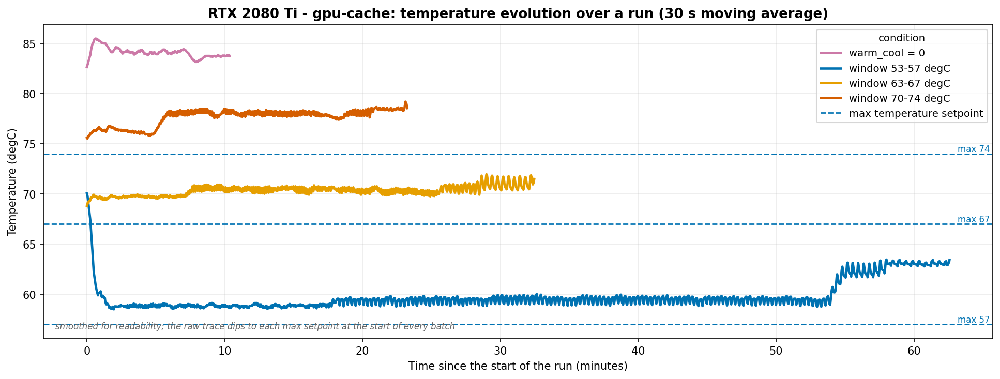
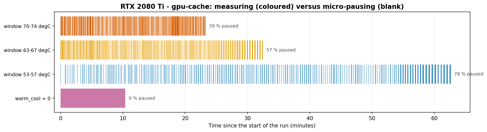
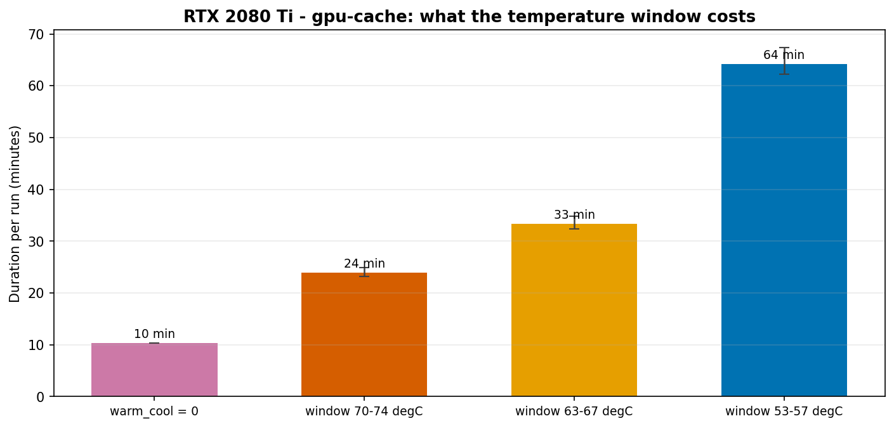

# Part 1 - Native CUDA on the RTX 2080 Ti

Three configurations, the same source workloads:

| Label | Build | Hardware | What it isolates |
|---|---|---|---|
| `cuda` | `release-cuda` | RTX 2080 Ti | Reference |
| `hipifiable@nvidia` | `release-hip-nvidia` | RTX 2080 Ti | Cost of the hipify translation, same hardware |
| `hipifiable@amd` | `release-hip-only` | MI210 | Behaviour on the target architecture |

The first two run on the **same card**, so any gap between them comes from the translation and
from nvcc compiling HIP, never from a hardware difference. The third changes the hardware, so
it is read against AMD's published figures rather than against the first two.

Each configuration gets its own part: **Part 1** below is the CUDA reference, **Part 2** puts
the two backends side by side on the same card, and **Part 3** is the MI210. Every figure comes
from a campaign of **10 runs**; `logs/` holds the raw output of all three.

Three benchmarks are shown as a dedicated layout rather than a curve, following what the
upstream repository publishes for them: an ILP x TLP table for `gpu-incore`, a 16-column
stride table for `gpu-strides`, and the `T = a + V/b` fit for `gpu-small-kernels`.

---

## 1.1 gpu-cache

- **Measures** the bandwidth of the on-chip caches (L1, then L2).
- **Good for** how fast the caches feed the cores, and reading each cache's size off the curve - bandwidth drops at the working set where the data stops fitting.
- **Method** one thread block per SM re-reads the same buffer in a loop; the buffer size is swept, so the served level shifts L1 → L2 → DRAM as it grows.
- **On the 2080 Ti** L2 is 5.5 MB: the curve should hold high while the working set fits in cache, then fall toward the ~616 GB/s DRAM level once it spills out.


## 1.2 gpu-incore

- **Measures** the latency and throughput of arithmetic instructions (FMA, DIV, SQRT).
- **Good for** the raw cost of each operation, and how much parallelism it takes to hide that latency.
- **Method** runs chains of one operation while sweeping ILP (1–8 independent chains) against TLP (warps per SM); reports cycles per operation.
- **On the 2080 Ti** consumer Turing runs FP64 at 1/32 of FP32, so `double` should sit roughly 32x above `float`, and the ILP1/TLP1 corner reads the ~4-cycle FMA latency (measured 4.13).


## 1.3 gpu-l2-stream

- **Measures** the bandwidth of the shared L2 cache, and of DRAM beyond it.
- **Good for** the sustained L2 vs main-memory bandwidth, and the footprint where the L2 stops helping.
- **Method** the four STREAM kernels (read, write, scale, triad) over a buffer whose size is swept across the L2 capacity.
- **On the 2080 Ti** L2 is 5.5 MB and DRAM peaks near 616 GB/s: the high plateau is the L2, the low plateau should approach 616 GB/s.


## 1.4 gpu-latency

- **Measures** memory access latency - the time for a single dependent load.
- **Good for** how many cycles a load costs at each level (L1 / L2 / DRAM), which sets how much work must be in flight to hide it.
- **Method** pointer chasing: one warp walks a buffer in random order, each load depending on the previous, so nothing can mask the round trip.
- **On the 2080 Ti** the steps should line up with the L1, the 5.5 MB L2, and DRAM - the deeper the level, the higher the latency.


## 1.5 gpu-memcpy

- **Measures** host ↔ device transfer bandwidth, over the PCIe link.
- **Good for** the cost of moving data on and off the GPU, and the transfer size at which PCIe saturates.
- **Method** copies buffers of increasing size between CPU and GPU and times them.
- **On the 2080 Ti** the bus is PCIe 3.0 x16, so the plateau should approach its ~15.75 GB/s ceiling.


## 1.6 gpu-roofline

- **Measures** compute throughput (GFLOP/s) against arithmetic intensity (FLOP per byte moved).
- **Good for** telling whether a kernel is limited by memory or by compute - the roofline model; the elbow is the crossover.
- **Method** sweeps the arithmetic intensity and plots the throughput actually reached.
- **On the 2080 Ti** the flat compute roof is ~13.45 TFLOP/s (FP32) and the slanted memory roof is set by ~616 GB/s; the elbow sits at their ratio.


## 1.7 gpu-small-kernels

- **Measures** the fixed cost of launching a kernel, against its bandwidth.
- **Good for** the smallest data volume worth a kernel launch: below it you pay mostly for the launch, not for the work.
- **Method** enqueues thousands of tiny `scale` kernels of varying size and fits `T = a + V/b` - `a` is the launch overhead, `b` the asymptotic bandwidth.
- **On the 2080 Ti** the DRAM peak is ~616 GB/s, so the fitted bandwidth `b` should approach it - it reaches ~548 GB/s, 89 %.


## 1.8 gpu-strides

- **Measures** L1 bandwidth as a function of the access stride.
- **Good for** what non-contiguous access costs: strided reads collapse the bandwidth through cache-bank conflicts, and the table shows which strides hurt.
- **Method** a single block reads with strides 1…N; the result is tabulated as bytes per cycle for each stride.
- **On the 2080 Ti** a warp is 32 threads: stride 1 saturates the L1, and strides that fall on the same cache bank collapse the bandwidth.


## 1.9 gpu-umstream

- **Measures** unified (managed) memory bandwidth, with a prefetch to the GPU.
- **Good for** the cost of unified memory against explicit copies, and its behaviour when the dataset exceeds the card's memory.
- **Method** STREAM over a unified-memory array prefetched to the device, sweeping the transfer size past the card's 11 GB.
- **On the 2080 Ti** there are 11 GB of GDDR6: while the array fits, the prefetched bandwidth approaches DRAM; past 11 GB it pages over PCIe 3.0 and collapses.


---

# Part 2 - CUDA versus HIP on the same NVIDIA card

Both campaigns ran on an RTX 2080 Ti of the same node, over **identical sweep points**, so the
comparison is point by point and the only variable is the backend.

Each figure carries the **mean of the 10 runs** of each backend, the shaded band being their
min–max spread, and a lower panel giving the HIP/CUDA ratio. That lower panel is where the
gap is actually readable: on most benchmarks the two means sit on top of each other.

---

## 2.1 gpu-cache


*Same shape. The only gap is in the cache-resident region (working set below the L2 size), where HIP sits a fraction of a percent apart. That region is served from the L1 and depends on the core clock, not on memory - so the offset most likely reflects a small thermal/clock difference between the two runs, not the backend.*

## 2.2 gpu-incore


*Identical: the HIP/CUDA ratio is essentially zero across the whole ILP x TLP table.*

## 2.3 gpu-l2-stream


*`read`, `scale` and `triad` match. `write` is the exception - HIP runs about 4-5 % slower in the DRAM regime, and its L2 -> DRAM transition falls slightly earlier.*

## 2.4 gpu-latency


*Identical - the two latency curves overlap at every cache level.*

## 2.5 gpu-memcpy


*Identical within the run-to-run noise (~0.1 % median).*

## 2.6 gpu-roofline


*The closest thing to a real gap: HIP sits about 1.7 % below CUDA across the sweep, on both the memory and the compute roof.*

## 2.7 gpu-small-kernels


*Same asymptotic bandwidth `b`. The one difference is the launch overhead `a`: HIP launches about 12 % faster, which only shows at the smallest data volumes.*

## 2.8 gpu-strides


*Identical - the deviation stays within +/-0.1 % at every stride.*

## 2.9 gpu-umstream


*Match within about 0.2 %.*

---

# Part 3 - HIP on the AMD MI210

The target architecture, 10 runs, backend `hip`.

**This part is read on its own.** Three benchmarks sweep a different range here than on the
2080 Ti - `gpu-cache` covers 40 points against 26, `gpu-memcpy` 24 against 21, `gpu-umstream`
26 against 19 - and the hardware differs anyway. The curves of Parts 1 and 2 do not
superimpose on these.

The power policy also differs, which matters when reading anything clock-related: the MI210
ran under a **230 W cap with free clocks** (`amd-smi`), while both 2080 Ti campaigns had their
**clocks pinned to TDP** (`nvidia-smi`) and no power cap.

---

## 3.1 gpu-cache


*MI210: L1 is 16 kB/CU and L2 is 8 MB; the plateau should fall toward the ~1638 GB/s HBM2e level once the working set leaves the caches.*

## 3.2 gpu-incore


*MI210: a wavefront is 64 threads (against 32 for an NVIDIA warp), which shifts where TLP saturates.*

## 3.3 gpu-l2-stream


*MI210: L2 is 8 MB and HBM2e peaks near 1638 GB/s; the low plateau should approach that figure.*

## 3.4 gpu-latency


*MI210: the steps should line up with the 16 kB/CU L1, the 8 MB L2, and HBM.*

## 3.5 gpu-memcpy


*MI210: the bus is PCIe 4.0, so the plateau should approach its ~31.5 GB/s ceiling.*

## 3.6 gpu-roofline


*MI210: the compute roof is ~22.6 TFLOP/s (FP32) and the memory roof is set by ~1638 GB/s HBM2e.*

## 3.7 gpu-small-kernels


*MI210: a wavefront is 64 threads, so a block of 32 fills only half of it - that is why b at block_size 32 is roughly half the saturated value.*

## 3.8 gpu-strides


*MI210: a wavefront is 64 threads; contiguous access saturates the L1, strided access collapses it.*

## 3.9 gpu-umstream


*MI210: there are 64 GB of HBM2e and a PCIe 4.0 bus; while resident, the prefetched bandwidth approaches HBM, past 64 GB it pages over PCIe.*

---

# Part 4 - Impact of the benchmark parameters

Each experiment here compares the **same workload on the same GPU**, changing exactly one
option, to justify the defaults and to show what silently breaks a measurement when a knob is
wrong. Two are covered so far: `flush` and `warm_cool`.

## The measurement loop

The options act on this loop, transcribed from `baseliner/core/Benchmark.hpp`:

```
setup_host / setup_device / warmup
repeat until the stopping criterion is satisfied:   ← one iteration = one batch
   ├─ warm_cool       reach the temperature window, then stop checking
   ├─ block           freeze the stream so the whole batch is queued before it runs
   └─ for each of batch_size runs:
         ├─ reset_device
         ├─ flush     empty L2 - before every run, not once per batch
         └─ timed run
fetch_results / validate
```

The two positions matter: **`flush` is inside the batch**, paid once per timed run, while
**`warm_cool` is outside it**, paid once per batch and never re-checked while the batch runs.

## 4.1 `flush` - L2 flush before every timed run

**Expected** No effect once the working set is far larger than L2, since the data could not have
stayed resident anyway. An effect in the L1/L2 region, where a stale cache would make the
benchmark report cache bandwidth instead of memory bandwidth.

**Status** *No result yet - the data was lost.* The campaign of 2026-08-31 ran both experiments,
but they wrote under the same file names (`avec-runNN.json`, `sans-runNN.json`) and `warm_cool`
ran second. The `manifest.csv` describes 40 runs where 20 files remain. Which set survived is
established, not assumed: the manifest gives 722 s constant across `warmcool/sans` against
738–771 s for `flush/sans`, and the files on disk have a standard deviation of 0.1 s.

**To do** Re-run with the outputs prefixed by experiment (`flush-avec-runNN.json`).

---

## 4.2 `warm_cool` - hold the GPU inside a temperature window

**Experiment** `gpu-cache` on the RTX 2080 Ti, backend `cuda`, campaign
`result_FlushL2_WarmCool_20260901_141122`: the option run at three target windows (53-57, 63-67,
70-74 degC) against a no-regulation baseline, 10 runs each, clocks left free (locking them would
hide the thermal effect), with a per-second `nvidia-smi` trace.

**It works - the window is held.** Without regulation the card climbs to ~84 degC and stays
there; with it, the card is kept around each target window for the whole run.



**How: by pausing between batches.** Before each batch the GPU is left idle to fall back into the
window - visible as utilization dropping to zero. The colder the window, the more of the run is
spent paused: 0 % without regulation, 39 % at 72 degC, up to **78 %** at 55 degC.



**The cost is time.** Those pauses multiply the wall-clock time of a run: about 2.3x at 72 degC
and 6.2x at 55 degC against the no-regulation baseline.



**In short.** The option pins the GPU to a chosen temperature window, which can help
reproducibility over a long campaign; but it has a negative side, the idle pause it inserts
before each batch, which costs wall-clock time and slightly widens the within-run spread.

---

# Part 5 - Reproducing this

Every figure comes from one of three campaigns kept whole under `logs/`:

| Campaign | Backend | Hardware | Used by |
|---|---|---|---|
| `Log_Test_RTX2080ti_cuda` | `cuda` | RTX 2080 Ti | Parts 1, 2 |
| `Log_Test_RTX2080ti_hip` | `hip` | RTX 2080 Ti | Part 2 |
| `Log_Test_MI210` | `hip` | AMD Instinct MI210 | Part 3 |

Each holds 191 files: `metadata.json`, then per benchmark a `.protocol.json` (the protocol), ten
zero-padded `.run<NN>.json` and their `.json.log`, plus one `run.log`.

Worth knowing before trusting or rerunning:

- **Provenance is partial.** `metadata.json` records the machine, GPU, backend, preset and
  throttling policy, but `git_version` is `not-provided` and driver/toolkit versions are
  absent - the exact binary cannot be pinned from the results.
- **Throttling differs between cards.** MI210: 230 W cap, free clocks. Both 2080 Ti campaigns:
  clocks pinned to TDP, no cap. Read this before comparing anything clock-related.
- **`Benchmark` options live only in the protocol.** A result carries `id`, `results` and
  `hardware` only, so `flush` / `warm_cool` are recoverable from `.protocol.json` / `metadata.json`
  alone - unless promoted to a sweep axis, where they land in `sweep_point`.
- **The figures are not regenerable from a clone yet:** the notebook that produces them is not
  in this repository.

Build and run instructions are in the [README](README.md).
